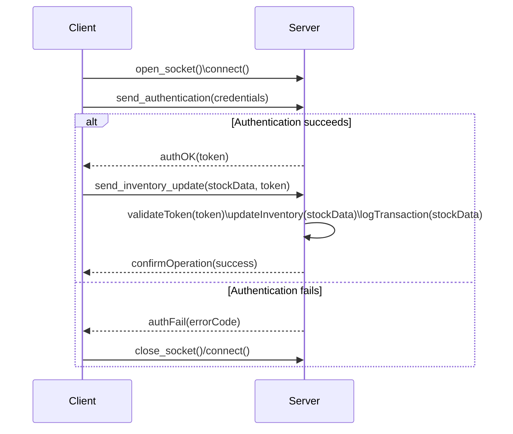
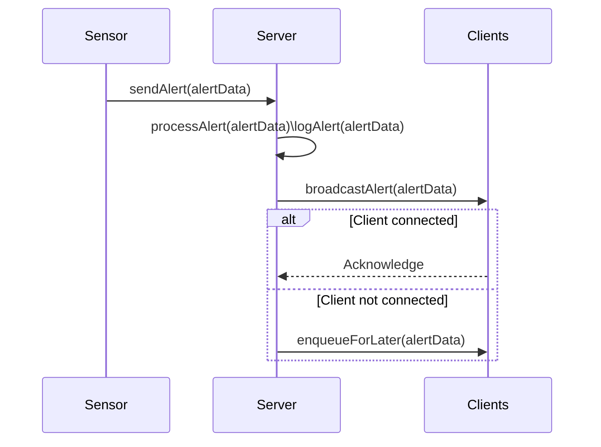
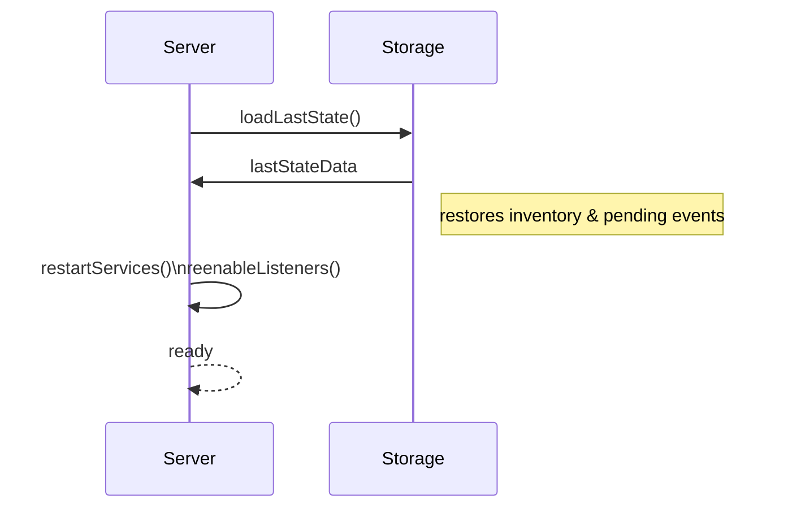

# Software Requirements Specification (SRS)

**Project:** Logistics Coordination System (*The Last of Us* Simulation)  
**Author:** Axel Covacich  
**Date:** 2025-05-08

---

## 1. Introduction

### 1.1 Purpose
This document specifies the requirements for the Logistics Coordination System, designed to efficiently manage the internal flow of inventory between warehouses and hubs in a post-apocalyptic simulation environment.

### 1.2 Audience and Intended Use
**Intended Audience:**  
- **Logistics Coordinators** overseeing resource distribution in post-apocalyptic settlements.  
- **Hub and Warehouse Operators** responsible for confirming deliveries and receiving critical alerts.  
- **Academic Evaluators** assessing system compliance with specified requirements.

**Intended Use and Value Proposition:**  
- Enable efficient **planning and distribution** of internal supplies.  
- Minimize **human error** and **stock loss** through automated alerts.  
- Provide **full traceability** of inventory movements for auditing.  
- Serve as a **simulation platform** for logistics scenarios in adverse conditions.

### 1.3 Scope
The system will initially implement a **client-server architecture**. A single central server will:
- Receive and process supply orders.
- Coordinate inventory updates.
- Generate and broadcast status alerts.
- Handle client authentication and log all interactions.
- Ensure communication between nodes via sockets.
- Implement fault recovery mechanisms to prevent data loss.

Clients (warehouses and hubs) will:
- Authenticate before operations.
- Send periodic stock updates.
- Receive and confirm deliveries.
- Display emergency alerts in real time.
- Handle shipment prioritization.

**Note:** External shipments, complex multi-node routing, and advanced role management are outside the current scope.

### 1.4 Definitions, Acronyms, and Abbreviations
- **MVP:** Minimum Viable Product.  
- **CI/CD:** Continuous Integration / Continuous Deployment.  
- **JSON:** JavaScript Object Notation.  
- **Hub / Warehouse:** Client nodes in the logistics network.  
- **Shipment:** Inventory transfer event between nodes.

### 1.5 References
- University project specifications.  
- IEEE 830-1998: Software Requirements Specification standard.  
- Unity Testing Framework, CMake documentation.

---

## 2. Overall Description

### 2.1 System Perspective
This system uses a **client-server architecture**: a central server coordinates and manages inventory flow among client nodes (warehouses and hubs) via JSON messages.

### 2.2 Product Functions
- Generation and prioritization of supply orders.  
- Logging and tracking of inventory updates.  
- Broadcasting and displaying alerts.  
- Immutable logging of all transactions.

### 2.3 Constraints
| ID   | Description                                                                                                                           |
|------|---------------------------------------------------------------------------------------------------------------------------------------|
| C001 | The server shall be developed in C++20.                                                                                               |
| C002 | The client shall be developed in C.                                                                                                   |
| C003 | Server and client shall communicate using sockets.                                                                                    |
| C004 | Message structure shall be standardized JSON for data exchange.                                                                       |
| C005 | The server shall broadcast emergency messages to all connected clients.                                                               |
| C006 | Clients shall acknowledge message reception via an acknowledgment system.                                                             |
| C007 | Server and client shall maintain a keep-alive message every minute.                                                                   |
| C008 | The server shall implement a graceful shutdown mechanism.                                                                             |
| C009 | Server and client shall follow the Linux Filesystem Hierarchy Standard (FHS).                                                        |
| C011 | The server shall be modular with separate components for networking, authentication, data processing, and IPC handling.             |
| C012 | The server shall support dynamic updates, allowing new features without recompilation. *(Optional)*                                  |
| C013 | The server shall handle multiple simultaneous client connections efficiently. *(Optional)*                                          |
| C014 | The server shall implement secure client authentication.                                                                              |
| C015 | IPC data shall be sanitized to prevent memory corruption vulnerabilities.                                                              |
| C016 | Clients shall operate with least privilege.                                                                                           |
| C017 | The server shall run under a dedicated system user.                                                                                   |
| C018 | Server and client shall log critical events with timestamps (`[Timestamp] [Component] [Log Level] Message`).                          |
| C019 | Server and client shall implement at least one internal IPC mechanism.                                                                |
| C020 | The client shall use shared libraries (`.so`) for feature upgrades without recompilation.                                              |
| C021 | Server and client shall support TCP/UDP over IPv4 and IPv6.                                                                           |
| C022 | The system shall support retrieving inventory transaction history per client.                                                         |
| C023 | The system shall be interactive via CLI for real-time user interaction.                                                               |
| C024 | The server shall support order cancellation within 30 seconds of submission.                                                         |
| C025 | The system shall be designed for containerized deployment.                                                                            |
| C026 | The system shall support Docker-based database deployment.                                                                            |
| C027 | The system shall limit unsuccessful password attempts to mitigate brute-force attacks (3 attempts, block via fingerprint device).     |
| C028 | The system shall validate all forwarded packets for format and authorized content.                                                   |
| C029 | The system shall allow automated backups of resource states with log rotation and compression for long-term storage.                 |
| C030 | The server shall maintain a queue for delayed events.                                                                                 |
| C031 | Server and client port numbers shall be configurable via environment variables.                                                       |
| C032 | The server shall allow configuration via YAML for queue sizes, max clients, and threshold values.                                     |
| C033 | The server shall be scalable, allowing new modules to be added without restart.                                                       |
| C034 | The server shall support automatic client updates, requesting restart or rollback on failure.                                          |
| C035 | Clients shall not access other clients' data to maintain confidentiality.                                                             |
| C036 | The server shall lock clients triggering an emergency alert until manually unlocked with a configured secret phrase.                  |
| C037 | The server shall generate automatic traffic reports, including message counts, errors, and reconnections for central analysis.       |

---

## 3. Specific Requirements

### 3.1 Functional Requirements **Must**
| ID     | Description                                                                                                    |
|--------|----------------------------------------------------------------------------------------------------------------|
| FR-001 | Server shall generate supply orders and prioritize shipments between hubs and warehouses.                      |
| FR-002 | Server shall process and broadcast alerts based on sensor logs (can be simulated with a Python script).        |
| FR-003 | Clients shall receive and display emergency alerts in real time (weather, infection, enemy threat).            |
| FR-004 | The client must register and update inventory every 60 seconds.						  |
| FR-005 | The server must handle at least 10,000 concurrent client connections without performance degradation.		  |

### 3.2 Non-Functional Requirements **Must**
| ID      | Description                                                                                                       |
|---------|-------------------------------------------------------------------------------------------------------------------|
| NFR-001 | Real-time monitoring (e.g., Grafana) for system health and metrics.                                               |
| NFR-002 | The system uptime must be at least 99%.									      |
| NFR-003 | Maximum 20 ms latency for critical message processing.                                                            |
| NFR-004 | Graceful failure recovery ensuring orders and inventory updates persist after unexpected shutdowns.               |

### 3.3 Quality Attributes
| Attribute                | Description                                                                                              |
|--------------------------|----------------------------------------------------------------------------------------------------------|
| Scalability              | Support thousands of concurrent nodes.                                                                   |
| Performance              | Critical operations <100 ms.                                                                             |
| Security & Authentication| Host-based credentials and TLS encryption.                                                               |
| Data Integrity           | Structured protocol with acknowledgments and retransmissions.                                            |
| Traceability & Logging   | Immutable per-transaction logs.                                                                          |
| Route Optimization       | Dynamic adjustment of routes to minimize waste.                                                          |
| High Availability        | Fault recovery and state consistency after restarts.                                                     |
| Fault Tolerance          | Retries and reassignment for pending shipments after failures.                                           |
| Extensibility            | Modular architecture for new nodes or protocols.                                                         |

---

## 4. Use Cases (Draft)
1. **CU-01: Create Order** – User submits a restocking request; server generates a Shipment. (Handled in Lab III)
2. **CU-02: Update Inventory** – Client reports current stock and receives confirmation.
3. **CU-03: Query Status** – User queries the state of current inventory.
4. **CU-04: Issue Alert** – Sensor generates an alert that the server broadcasts to clients.
5. **CU-05: Fault Recovery** – After server restart, system restores last consistent state.

---

## 5. Diagrams

Below are the sequence diagrams for key use cases.

### 5.1 CU-02: Update Inventory:

In this case client open socket and connects to server, sends credentials to server for authentication and recieves a success or fail response from server. On a successfull auth, recieves a token, then client sends inventory for update and token validation. Server process the request (token, stock and log), and responds with a confirmation of the operation. In case of a negative authentication, server will respond with a fail on auth and client close connection (or erorr message) and may try again.


**NOTE**: This scenario matches CU-03: Query Status flow secuence so to avoid redundance of diagrams it will not have its own secuence diagram considering its covered on this case.

### 5.2 CU-04: Issue Alert:

In this scenario, a sensor component notifies the server of an emergency alert (e.g., weather warning, infection outbreak, or enemy threat). The server processes and logs the alert, then broadcasts it to all currently connected clients. Each client acknowledges reception; if a client is disconnected, the server enqueues the alert for later delivery.


### 5.3 “CU-05: Fault Recovery”

In this use case, when the server starts up after a crash or planned restart, it retrieves the last persisted state from storage before resuming normal operation. The storage component returns all necessary data (e.g., inventory levels and any pending events). Once the server has reloaded this state, it restarts its internal services and re-enables its listeners to accept new client connections. Finally, the server marks itself as ready.



### 5.4 Packet diagram

Here is a first approach of a packet diagram of the client/server module scheme.

The Client side uses a shared library (CLib) to handle all socket connections and JSON message framing. CLib also writes timestamped “critical” events to its Client Logging component before sending or after receiving any request or response.

On the Server side, the Network module listens for and accepts TCP/UDP connections, reads raw bytes, and passes framed JSON payloads to the appropriate business module. The Authentication module verifies credentials and returns either a success or failure message back to Network. The Inventory module applies stock updates, emits a log entry to Logging, performs durable reads and writes against Storage, acknowledges the client, and—if persistence fails—routes the event into EventQueue for retry. The Alerting module generates real‐time notifications, logs each alert event, broadcasts messages to all connected clients, and queues offline alerts in EventQueue.

The Logging module centralizes all critical events and forwards them to Storage for durable retention, ensuring full traceability. Finally, EventQueue manages any failed deliveries (whether inventory syncs or offline alerts) by retrying or flagging them for manual review through the Network layer.

```mermaid
---
config:
  layout: dagre
---
flowchart LR
 subgraph Server["Server"]
        Net["Network"]
        Auth["Authentication"]
        Inv["Inventory"]
        Alert["Alerting"]
        Log["Logging"]
        Stg["Storage"]
        EQ["EventQueue"]
  end
 subgraph Client["Client"]
        CLib["Client Library (CLib)"]
        CLog["Client Logging"]
  end
    CLib -- log events --> CLog
    CLib <-- JSON/TCP --> Net
    Net -- authenticate --> Auth
    Net -- update --> Inv
    Net -- forward process --> Alert
    Auth -- success/fail --> Net
    Inv -- log --> Log
    Inv -- syncfail --> EQ
    Inv -- ack --> Net
    Alert -- log --> Log
    Alert -- broadcast --> Net
    Inv -- read/write --> Stg
    Log -- persist --> Stg
    Alert -- offline --> EQ
    EQ -- retry/review --> Net

  
  ```
