# 1. Introduction

This system is the foundation for future implementations and features of the complete project. It is based on a client-server environment where the server manages connections using TCP and UDP sockets. Clients can connect to the server using its address and ports, and interact via CLI commands.
    
The system is set in a 'Last of Us' world scenario with the central server coordinating Hubs and Warehouses, each with inventory, security, and notification systems. The main goal of this project is to establish a functional server that efficiently, safely, and concurrently manages basic communications with multiple clients, supporting many simultaneous connections without performance degradation.

# 2. System Architecture

The system follows a client-server architecture. The central server is responsible for managing all business logic, client connections, inventory data, notifications, and security. Clients connect to the server using TCP and UDP sockets, interacting via a command-line interface.

**Main components:**
- **Server:** Handles multiple simultaneous client connections, manages authentication, inventory, notifications, logging, and exposes metrics for monitoring.
- **Clients:** CLI applications that connect to the server, authenticate, send commands (such as inventory queries or updates), and receive notifications.
- **Monitoring stack:** Prometheus collects runtime metrics exposed by the server, and Grafana provides dashboards for visualization.
- **Backup scripts:** Python scripts are provided to automate backup of logs and database files.

**Communication:**
- Clients connect to the server over TCP for commands and session management.
- UDP is used for real-time notifications from the server to clients.
- Internal server components may use UNIX sockets for IPC.

**Persistence and monitoring:**
- All persistent data (database, logs, backups) are stored in dedicated directories, which are mapped as Docker volumes for durability.
- The server exposes a metrics endpoint for Prometheus, enabling real-time monitoring and alerting.

**System Architecture Diagram:**

```mermaid
---
config:
  layout: dagre
---
flowchart LR
    subgraph Client["Client (C Executable)"]
        Cli["Hub or Warehouse"]
        Dashboard["Python Dashboard"]
        Cli -- "POSIX MQ (IPC, internal)" --> Dashboard
    end

    subgraph Server["Server (C++)"]
        Srv["Main Server"]
        AlertSensor["Python Alert Sensor"]
        AlertSensor -- "UNIX File (IPC)" --> Srv
    end

    Cli <-->|"TCP (JSON)"| Srv
    Cli <-->|"UDP (Keepalive)"| Srv
    Srv -- "UDP (Notifications)" --> Cli

    Srv -- "Metrics (Prometheus-cpp)" --> Prometheus[Prometheus]
    Prometheus -- "Data Source" --> Grafana[Grafana]

    %% Volumes for persistence
    Srv -- "DB, Logs, Backups" --- Storage[(Persistent Storage)]
  
  ```

**Description & Clarifications:**

- **TCP (JSON):**
  Bidirectional communication; client sends commands, server responds with acknowledgements, data, or errors.

- **UDP (Keepalive):**
  Bidirectional; client sends periodic "ping" messages, server responds with "pong" or status.

- **UDP (Notifications):**
  Unidirectional; server sends notifications to client.

- **IPC (POSIX MQ):**
  Client uses internal IPC to send notifications to the Python dashboard for display.

- **Alert Sensor (Python):**
  Sends alerts to the server via IPC (UNIX file); server reads these alerts and broadcasts them to clients.

- **Persistence:**
  All persistent data (database, logs, backups) are stored using SQLite (via SQLiteCpp library) and mapped as Docker volumes for durability.

- **Metrics:**
  Server exposes metrics using prometheus-cpp, scraped by Prometheus and visualized in Grafana.

> **Notes:** 
- SQLiteCpp is a C++ wrapper for SQLite, which is a lightweight, file-based relational database (not MySQL).
- All persistent data (database, logs, backups) are stored in mapped Docker volumes.


# 3. Design Decisions

Python was chosen for the scripts because it is easier and faster to write small utilities and dashboards compared to C or C++. This allowed for quick setup of components like the dashboard and the alert sensor without the need to manage low-level details.

Regarding modularity, the code was divided by responsibility and function. For example, a main class was implemented to start all components, a server class to handle connections and configuration, an authenticator class dedicated to authentication, a storage class for database communication and so on with each class. Each class is responsible for a specific task, which makes the code easier to understand and maintain.

TCP was selected for commands to ensure that no messages are lost. Commands are important and always require a response from the server, whether it is an acknowledgment or data. TCP provides reliable communication, which is suitable for this purpose.

UDP was used for notifications and keepalive messages because it is faster and the information is not critical. If a notification or keepalive message is lost, it does not affect the system significantly, making UDP an appropriate choice.

For IPC, at least one mechanism was required in both the server and client. On the client side, a POSIX message queue was used because it allows setting priorities for messages, which is useful for notifications—more important messages can be handled first. On the server side, a UNIX file was used for the alert sensor, as it is simple and practical: the sensor writes alerts to the file, and the server reads them.

SQLiteCpp was selected for the database due to its ease of integration with the codebase. While it may not be the most efficient database available, it is sufficient for this project and requires minimal setup. With CMake's FetchContent, it can be fetched and used immediately.

Log rotation and backup were implemented as required. A configurable maximum size for the server log is set in a YAML file. When the log exceeds this size, it is compressed and a new log file is created. Additionally, a Python script is provided to back up the database and the compressed log files.

## Concurrency and Performance

Initially, the server used the `select` system call with a one-thread-per-connection approach for handling client connections. While this worked well for a small number of clients, it quickly became unfeasible for supporting a large number of simultaneous connections (e.g., 10,000), as each thread consumes significant system resources and context switching becomes a bottleneck.

To address this, the `clientSession` class and the server's main loops were restructured to integrate `epoll` with a thread pool. This approach allows the server to efficiently handle many concurrent connections: `epoll` monitors file descriptors for read/write events without blocking on each connection, and any thread from the pool can process incoming events. This design enables the server to scale to thousands of clients with minimal performance degradation. The `threadpool` class was created to manage the pool of worker threads, with a default of 16 threads, and to assign tasks as events are detected.

## Connection, Authentication and Permissions

When a client connects, it is assigned a `clientSession` object that persists for the duration of the connection. This object manages the entire lifecycle for the client, including command interpretation, login, and all interactions. A `sessionManager` oversees all active `clientSession` instances, maintaining lists of sessions, offline users, and locked users.

Upon connecting, a user must authenticate before being allowed to execute any commands. Each user has three login attempts; after three failures, the account is locked for 15 minutes. If the login is successful, the session state is updated to authenticated, allowing access to further commands.

User registration is currently handled by the admin through a special `register_user` command, which only the admin can execute. (This process is not fully automated and could be improved; this limitation is also noted in the known issues section.)

Each user has specific command permissions:  
- **Hubs** can query stock, inventory, and history (read-only operations).
- **Warehouses** have all the permissions of Hubs, plus the ability to update stock.
- **Admin** users can perform all previous actions, unlock users blocked by alerts, and register new users.

If a user triggers an alert (simulated by the Python sensor), that user is locked until the admin unlocks the account using a secret phrase stored in the `config.yaml` file.

For authentication and security, passwords are stored as bcrypt hashes in the database, ensuring secure authentication even though this adds some computational overhead. Logging of password entries is handled carefully: a small function censors the password in logs to avoid exposing sensitive information.

## Error Handling and Data Integrity

To ensure error prevention and data integrity, try-catch blocks were used throughout the code, especially during message parsing, command execution, and data validation. On the client side, every command entered by the user is checked for correct format; if the input is invalid, the client notifies the user with an error and the expected usage. The client also attempts to construct JSON messages properly before sending them.

On the server side, all expected fields in incoming messages are validated. If any required field is missing or invalid, the server throws a controlled exception and informs the client of the error. The severity of the error determines the response: for example, if an attempt is made to update an invalid stock item (the inventory maintains a list of valid stock), the server notifies the client of the error.

Every important action that involves transmitting data or passing information between functions is validated. For example, in the storage module, all operations are wrapped in try-catch blocks to ensure that any failure is handled appropriately—whether by notifying the client, closing the connection, or shutting down the server in case of a critical error.

In the configuration class, the contents of the `config.yaml` file are read and validated. If any required value is missing or invalid, the server automatically shuts down to prevent running with incorrect settings.

## Monitoring and Testing

Prometheus and Grafana were integrated to provide real-time metrics for message counts and errors, which was also a non-functional requirement. Metrics exposed include counts of TCP, UDP, and IPC messages, successful operations, errors, connections, and reconnections. These metrics are useful for monitoring the server and overall system status, detecting potential issues with specific protocols, observing behaviors, and gaining insight into server performance.

For testing, unit tests were implemented using Unity, as it was practical and straightforward for this project. Unit tests were written to cover each class and relevant cases, focusing on expected logic and error handling rather than complex integration scenarios such as TCP connection testing. The achieved test coverage is approximately 70% for both server and client components. Quality was ensured by testing edge cases and expected behaviors wherever possible. Additional tools such as Clang, SonarQube, CDash, and Valgrind were used to support code quality and reliability.


# 4. Implementation Details

## Server

### General Structure

The project is organized following the Linux Filesystem Hierarchy Standard (FHS), with all components contained within a single workspace directory. This means there are no system-wide installations required, except for external dependencies such as Grafana or Prometheus.

The server is built around several key classes, each responsible for a specific aspect of the system. Here are detailed some of the most relevant:

- **Server:** Handles configuration, manages network connections, and sets up all sockets (TCP, UDP, UNIX).
- **ClientSession:** Represents an individual client connection; one instance is created for each TCP connection.
- **CommandProcessor:** Processes user commands received from clients.
- **Storage:** Interfaces with the database for all data operations.
- **Logger:** Manages logging of server activity and log rotation.
- **Inventory:** Handles inventory management and stock operations.
- **Authenticator:** Manages user authentication and password verification.
- **UdpHandler:** Manages UDP communication for notifications and keepalive messages.
- **IpcHandler:** Handles inter-process communication for alerts and dashboard integration.
- **AlertManager:** Processes and broadcasts alerts received from the alert sensor.

Each class is designed with a clear responsibility, making the codebase modular and easier to maintain.

### Key Features

#### Connection handling
Connections are managed via sockets configured with `getaddrinfo` for both IPv4 and IPv6 (TCP and UDP). All server sockets are set non-blocking and registered with `epoll`. The main server loop calls `epoll_wait` and dispatches events until a shutdown signal is received.

- On a new TCP connection the server `accept()`s the socket, makes it non-blocking, adds it to the `epoll` instance and creates one `ClientSession` (shared_ptr) per connection. That `ClientSession` owns the lifecycle for that client (receive/parse messages, authenticate, process commands, send responses).
- UDP and UNIX (IPC) sockets are also added to `epoll`; UDP events are delegated to the `UdpHandler`, and new UNIX connections are handled by `IpcHandler` tasks in the thread pool.
- `epoll` is used together with `EPOLLONESHOT` to avoid concurrent event handling on the same FD. After a worker finishes processing a session it re-arms the FD (adds `EPOLLIN` and `EPOLLOUT` when pending writes exist).

#### Authentication and permissions

Authentication and permissions are centralized in the `Authenticator` and `SessionManager`:

- Users and bcrypt-hashed passwords are stored in the database. Login attempts are validated against those records.
- A user has three login attempts; on three consecutive failures the account is locked for 15 minutes.
- Roles and permissions are enforced by checking the user role (Hub, Warehouse, Admin) before executing commands:
  - Hubs: read-only (inventory, stock, history).
  - Warehouses: read/write (can update stock).
  - Admin: full privileges (including user registration and unlock).
- User registration is currently performed by an admin-only command. The initial admin is created at startup (not yet automated).

#### Concurrency, epoll and thread pool

To scale to many simultaneous clients the server uses an `epoll` + thread pool model:

- `epoll` efficiently monitors thousands of file descriptors for readiness (it avoids scanning all FDs like `select`/`poll`).
- Sockets are non-blocking; `epoll_wait` returns ready FDs and worker threads from the `ThreadPool` perform the heavy work (reading, parsing, command processing).
- `EPOLLONESHOT` is used so only one thread handles a given FD at a time; the FD is re-armed after processing.
- Critical shared resources (storage, inventory, authenticator, logger, session lists) are protected by mutexes to guarantee thread-safety.
- This design minimizes context switches and resource usage versus a thread-per-connection model, enabling the server to handle large numbers of concurrent connections.

#### Storage (database)

The `Storage` module is the single interface to persistent data:

- It opens/creates a SQLite file under `project_root/var/lib` and initializes the schema (tables: `users`, `inventory`, `logs`).
- All DB reads/writes go through `Storage` methods (e.g., `createUser`, `getStock`, `saveStockUpdate`, `userExists`).
- Access to the DB is serialized where required (mutex) to maintain consistency.
- SQLiteCpp is used as the C++ wrapper; CMake fetches and configures it automatically.

#### Logging and rotation

Logging follows the project requirements:

- Each module uses the shared `Logger` instance and calls `log(level, component, message, clientID)`; writes are protected by a mutex.
- Logs are persisted in a plain log file and also recorded/usable via the `logs` DB table.
- A maximum log file size is configured in `config.yaml`. When the limit is reached the current log file is compressed (gzip via zlib) and a new log file is created (rotation). Compressed files are kept for backup.
- A Python backup script is provided to periodically save the database file and compressed logs.

#### Scripts and IPC

Scripts live in the `scripts/` folder and cover administration and simulated sensors:

- An alert sensor script simulates external alerts by writing messages to the server's UNIX IPC file (alert type, message, optional clientID). The server reads these entries and uses `AlertManager` to broadcast alerts to clients.
- A backup script automates periodic backup of the SQLite DB and compressed logs (instructions inside the script).
- A helper bash script is provided to create a dedicated system user and install the server as a service.

#### Metrics (Prometheus & Grafana)

Monitoring is implemented with `prometheus-cpp` and Grafana:

- `TrafficReporter` registers counters/gauges for TCP/UDP/IPC message counts, successful operations, errors, connections and reconnections.
- Metrics are exposed on the configured port (via `TrafficReporter::startPrometheusExposer`).
- Prometheus scrapes the exposed endpoint and Grafana visualizes the metrics in dashboards (admin must add Prometheus as Grafana data source).

### Main Flows

#### Client session lifecycle (command flow)
- A new TCP connection is accepted, set non-blocking and registered with epoll. The server creates one `ClientSession` (shared_ptr) per connection.
- `ClientSession::run()` is the main per-connection loop invoked by a worker thread after epoll signals activity on the socket. It performs the read, JSON parse and calls `processMessage(...)`.
- Messages between client and server use TCP with JSON. `processMessage` returns a `processResult` (`std::pair<std::string,bool>`) where the string is the JSON response and the bool indicates whether the session should remain open.
- If the client is not authenticated and the message is not a login, the server returns an error asking the user to authenticate. If the message is a login, `Authenticator` validates credentials (bcrypt hashes stored in DB). On success the session state (authenticated boolean) is set and the client can issue other commands.
- Authenticated commands are routed to `CommandProcessor` which executes the requested action by calling the responsible module (e.g., `Inventory`, `Storage`). `CommandProcessor` builds the response based on the operation result and returns it to the `ClientSession`.
- The worker thread sends the JSON response back to the client. If `processResult.second` is false (e.g., fatal error or `end` command), the session is closed and cleaned up .
- UDP is used in parallel for keepalive and notifications. Keepalive messages are handled by `UdpHandler::handleKeepalive`, which updates the session UDP address via `SessionManager` and replies with a PONG. Notification delivery (server→client) uses UDP; if a target client is offline the message is enqueued in `EventQueue` for later delivery.
- Critical sections (storage, inventory, session lists, logger) are protected by mutexes to ensure thread-safety when multiple worker threads process events concurrently.

#### Alert flow (sensor → server → clients)
- The alert sensor (Python script) writes alert messages to the server's UNIX IPC file.
- An epoll notification for the IPC FD schedules `IpcHandler` work in the thread pool. A worker reads the alert message from the FD and forwards it to `AlertManager`.
- `AlertManager` parses the alert (type, message, optional `clientID`). Certain alert types (e.g., `enemy_threat`, `infection`) trigger a user lock: `SessionManager` marks the affected `clientID` as locked. Informational alerts (e.g., `weather`) do not lock users.
- The alert is then broadcast via `UdpHandler::broadcastMessage` to all active clients. `UdpHandler` looks up active UDP addresses from `SessionManager` and sends the alert via `sendto`. Each successful/failed send updates metrics via `TrafficReporter`.
- For clients that are offline, the alert is queued using `EventQueue.pushEvent(user, Event{...})`. When the client next reconnects, queued events are delivered (server checks `hasPendingMessages()` / `trySendPendingMessage()` in the `ClientSession` flow).
- Note: only authenticated (logged-in) sessions receive notifications. If a session is not authenticated, it will not receive UDP notifications.

#### Additional notes
- epoll + thread pool model: epoll detects ready FDs and worker threads perform I/O and command processing; `EPOLLONESHOT` is used to avoid concurrent handling of the same FD and FDs are re-armed after processing.
- Responses are always constructed as JSON with status/metadata; error handling and input validation are enforced at each parsing/execution step and communicated back to the client.

### Validation and Error Handling

- Input validation is performed at every step where external data is received or transferred. JSON messages are parsed and required fields are checked (clientSession, CommandProcessor). Missing or malformed fields are caught and produce a controlled error response to the client.

- Exceptions are handled with try/catch blocks around parsing and execution paths:
  - `clientSession::processMessage` parses incoming JSON inside a protected block and handles expected JSON exceptions (missing fields, type errors). If parsing fails, a clear JSON error reply is returned and the session remains open (unless the error is critical).
  - Unexpected exceptions that propagate to the top of `processMessage` are caught and treated as internal errors: an error reply is sent and the session is closed to avoid undefined behavior.

- Error severity determines the reaction:
  - Recoverable errors (bad input, validation failures) generate an error response to the client and do not terminate the server or necessarily close the session.
  - Fatal or internal errors (critical exceptions, invalid configuration at startup) may lead to closing the client session or shutting down the server (for example, invalid `config.yaml` makes the server exit on startup).

- Each component returns explicit success/failure indicators where appropriate (bool or int return values). Calling code checks these results and acts accordingly (retry, notify client, close session).

- Logging and metrics are integrated with error handling:
  - The shared `Logger` records warnings, errors and critical events (passwords are redacted before logging).
  - `TrafficReporter` counters are incremented for protocol errors (e.g., `incrementError("tcp","rx")`) so monitoring reflects validation and runtime issues.

- Concurrency and safety: critical sections (storage, inventory, authenticator, session lists, logger) are protected with mutexes. Storage and other modules validate inputs and wrap DB operations in try/catch to avoid corrupt state; failures are reported and handled centrally.

- Configuration validation: the `Config` module validates `config.yaml` on startup. If required values are missing or invalid, the server logs the issue and exits to prevent running with incorrect settings.

Overall, the system favors explicit validation, controlled exception handling, informative client responses, and conservative shutdown behavior for unrecoverable errors.

## Class Diagram for Server

The follow diagram shows the interactions between each module nad its main attributes. For simplicity, only the most relevant attributes or methods are listed.

```mermaid 
---
config:
  layout: dagre
---

classDiagram
    class Server {
        +Server(Config, SystemClock, Storage, Logger, TrafficReporter)
        +run()
        +getClientIp()
        -setupServer()
        -setTCPConfig()
        -setUDPConfig()
        -setUNIXconfig()
        -handleTcpConnection()
        -handleUNIXConnection()
        -tcpHandling(fd)
        -pendingMessages(fd)
        -m_clientSessions : map < int, ClientSession >
        -m_tcpPort: int;
        -m_udpPort: int;
        -m_serverTCPFD: int;
        -m_serverUDPFD: int;
        -m_serverUnixFD: int;
        -m_epollFD: int;
        -m_config: Config&;
        -m_clock: SystemClock&;
        -m_storage: Storage&;
        -m_logger: Logger&;
        -m_traffocReporter: TrafficReporter&;
        -m_threadPool: ThreadPool;
        -m_eventQueue: EventQueue;
        -m_inventory: Inventory;
        -m_authenticator: Authenticator;
        -m_alert: AlertManager;
        -m_sessionManager: SessionManager;
        -m_udpHandler: UdpHandler;
        -m_ipcHandler: IpcHandler;
    }
    class enable_shared_from_this
    class ClientSession {
        +ClientSession(int, Inventory, Authenticator, Logger, Config, TrafficReporter, EventQueue, UdpHandler)
        +run(): bool
        +isAuthenticated(): bool
        +processMessage(json_string: string): processResult
        +createLoggableRequest(request: json): json
        +setUdpAddress(addr: sockaddr_storage)
        +getUdpAddress(): shared_ptr<sockaddr_storage>
        +handleEventQueue(): bool
        +trySendPendingMessage(): bool
        +hasPendingMessages(): bool
        +sendWelcomeMessage(): bool
        -processResult: pair< string, bool > (type alias)
        -m_clientSocket: int;
        -m_clientID: string;
        -m_isAuthenticated: bool;
        -m_clientIP: string;
        -m_udpAddress: shared_ptr < sockaddr_storage >
        -m_sessionMutex: mutex;
        -m_pendingMessages: deque< string >
        -m_trafficReporter: TrafficReporter&;
        -m_inventory: Inventory&;
        -m_authenticator: Authenticator&;
        -m_eventQueue: EventQueue&;
        -m_logger: Logger&;
        -m_storage: Storage&;
        -m_config: Config&;
        -m_sessionManager: SessionManager&;
        -m_udpHandler: UdpHandler&;

    }
    class CommandProcessor {
        <<namespace>>
        +processCommand() :commandResult
        +handleStatusCommand()
        +handleEndCommand()
        +handleGetInventoryCommand()
        +handleGetStockCommand()
        +handleUpdateStockCommand()
        +handleGetHistoryCommand()
        +handleUnlockClientCommand()
        +handleRegisterUserCommand()

    }
    class Storage {
        -m_db: SQLite::Database;
        -m_dbMutex: std::mutex;
        +Storage(string &dbPath, int openFlags)
        +initializeSchema()
        +readData() 
        +writeData()
        +createUser(hostname, password)
        +saveStockUpdate()
        +getStock()
        +userExists()

    }
    class Authenticator {
        -m_clock: SystemClock&;
        -m_mutex: std::mutex;
        -m_storage: Storage&;
        -m_logger: Logger&;
        +Authenticator(Storage, SystemClock, Logger)
        +authenticate(hostname, password, BlockDuration):AuthResult
    }
    class Inventory {
        -m_mutex: std::mutex;
        -m_storage: Storage&;
        -m_logger: Logger&;
        -m_validItems: map< string, set< string>>;
        -m_fullyCachedClients: set< string >;
        -m_inventories: map< string, map< string, map < string, int>>>
        +Inventory(Storage, Logger)
        +getInventorySummary()
        +updateStock()
        +getStock()
    }
    class Logger {
        -m_logFile: offstream;
        -m_fileMutex: mutex
        +Logger(Storage&, SystemClock&, ostream&, Config&)
        +log(level, component, message, clientID)
        +closeLogFile()
        +logRotation()
        +openLogFile(filePath)
        +compressFileGzip()
    }
    class SessionManager {
        -m_activeSessions: map< string, shared_ptr< clientSession >>;
        -m_lockedClients: set< string >;
        -m_connectedUsers: unordered_set< string >;
        -m_offlineUsers: unordered_set< string >
        -m_mutex: mutex;
        +SessionManager(Storage&, Logger&, TrafficReporter&) 
        +registerSession()
        +removeSession()
        +lockClient()
        +unlockClient()
        +getOfflineUsers()
        +getActiveUdpAddresses()
    }
    class ThreadPool {
        -m_threads: vector < thread >
        -m_taskQueue: queue < function < void >>;
        -m_queueMutex: mutex;
        -m_queueCV: condition_variable;
        -m_running: atomic < bool >;
        -workerThread()
        +ThreadPool(numThreads)
        +enqueueTask(task)
        +stop()
    }
    class UdpHandler {
        -m_udpSocketFd: int;
        -handleKeepAlive(json request, client_addr)
        +UdpHandler(UdpSocketFd, Logger&, SessionManager&, TrafficReporter&, EventQueue&)
        +broadcastMessage(message)
        +handleMessage()
        +setSocketFd(fd)
        +sendMessageToClient( clientID, message, client_addr)
    }
    class IpcHandler {
        +IpcHanlder(Logger&, AlertManager&, TrafficReporter&)
        +handleConnection(fd)
    }
    class TrafficReporter {
        -m_message_counters: map;
        -m_error_counters: map;
        -m_reconnections_counters: map;
        +initPrometheusMetrics()
        +incrementMessage(protocol, dir)
        +startPrometheusExposer(port)
        +incrementError(protocol, direction)
        +incrementReconnection(protocol, direction)
    }
    class Config {
        -m_configNode: YAML:NODE;
        -validatePort(args)
        +Config(args)
        +logConfig()
        +serverConfig(args)
        +databaseConfig()
        +securityConfig()
        +getTcpPort()
        +getUdpPort()
        +getUnixSocketPath()
        +getMaxClients()
        +getMetricHostPort()
    }
    class EventQueue {
        -m_queueSize: int
        -m_eventQueueMap: unordered_map< string, dequeue < Event >>;
        +EventQueue(queueSize, Logger&)
        +enqueue(clientID, eventin)
        +dequeue(clientID, eventout)
    }
    class AlertManager {
        +alertManager(Logger&, SessionManager&, UdpHandler&)
        +processAlert(alertMessage)
    }

    %% Relationships (composition/association)
    Server "1" --> "N" ClientSession : manages
    Server "1" --> "1" Logger : uses
    Server "1" --> "1" ThreadPool : uses
    Server "1" --> "1" UdpHandler : uses
    Server "1" --> "1" IpcHandler : uses
    Server "1" --> "1" Config : uses

    clientSession --|> enable_shared_from_this : inherits
    ClientSession --> Inventory : uses
    ClientSession --> Authenticator : uses
    ClientSession --> Logger : uses
    ClientSession --> Storage : uses
    ClientSession --> SessionManager : uses
    ClientSession --> Config : uses
    ClientSession --> TrafficReporter : uses
    ClientSession --> EventQueue : uses
    ClientSession --> UdpHandler : uses
    ClientSession --> CommandProcessor : uses

    CommandProcessor --> Inventory : uses
    CommandProcessor --> Storage : uses
    CommandProcessor --> Logger : uses
    CommandProcessor --> SessionManager : uses
    CommandProcessor --> Config : uses
    CommandProcessor --> TrafficReporter : uses

    Authenticator --> Storage : uses
    Authenticator --> Logger : uses

    Inventory --> Storage : uses
    Inventory --> Logger : uses

    SessionManager --> Logger : uses
    SessionManager --> TrafficReporter : uses
    SessionManager --> Storage : uses

    UdpHandler --> Logger : uses
    UdpHandler --> SessionManager : uses
    UdpHandler --> TrafficReporter : uses
    UdpHandler --> EventQueue : uses

    IpcHandler --> Logger : uses
    IpcHandler --> AlertManager : uses
    IpcHandler --> TrafficReporter : uses

    AlertManager --> Logger : uses
    AlertManager --> SessionManager : uses
    AlertManager --> UdpHandler : uses

    EventQueue --> Logger : uses

    %% Showing only relevant methods for clarity  
```



# 5. Requirements Coverage

# 6. Testing & Validation

# 7. Issues & Solutions

# 8. Limitations & Future Work

# 9. Conclusions